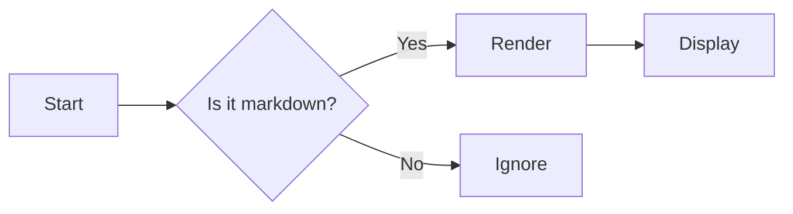
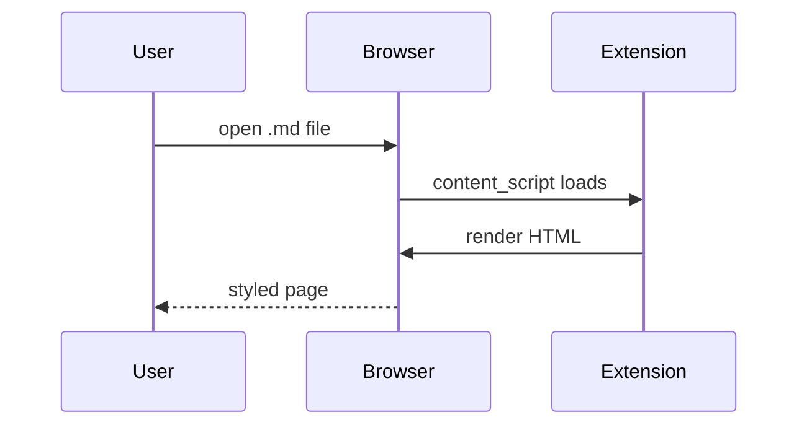

# Mermaid Fixture

Flowchart:

```mermaid
flowchart LR
  A[Start] --> B{Is it markdown?}
  B -- Yes --> C[Render]
  B -- No --> D[Ignore]
  C --> E[Display]
```

Sequence:

```mermaid
sequenceDiagram
  User->>Browser: open .md file
  Browser->>Extension: content_script loads
  Extension->>Browser: render HTML
  Browser-->>User: styled page
```
