# 🎨 Markdown Viewer — Showcase

> A heavy test file: emoji icons, complex Mermaid diagrams, tables, math, code, TOC, everything at once.

---

## 🧭 Overview

| Area | Status | Priority |
|------|:------:|---------:|
| 🚀 Rendering | ✅ Done | High |
| 🎨 Themes | ✅ Done | High |
| 📊 Diagrams | 🟡 Testing | Medium |
| 🔢 Math | 🟡 Testing | Medium |
| 🔒 Security | ✅ Done | Critical |
| 🐛 Edge cases | 🔴 Ongoing | Low |

---

## 🔀 Architecture — Flowchart

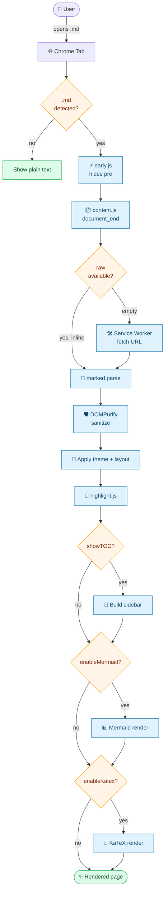

---

## 🔁 Sequence — Boot flow

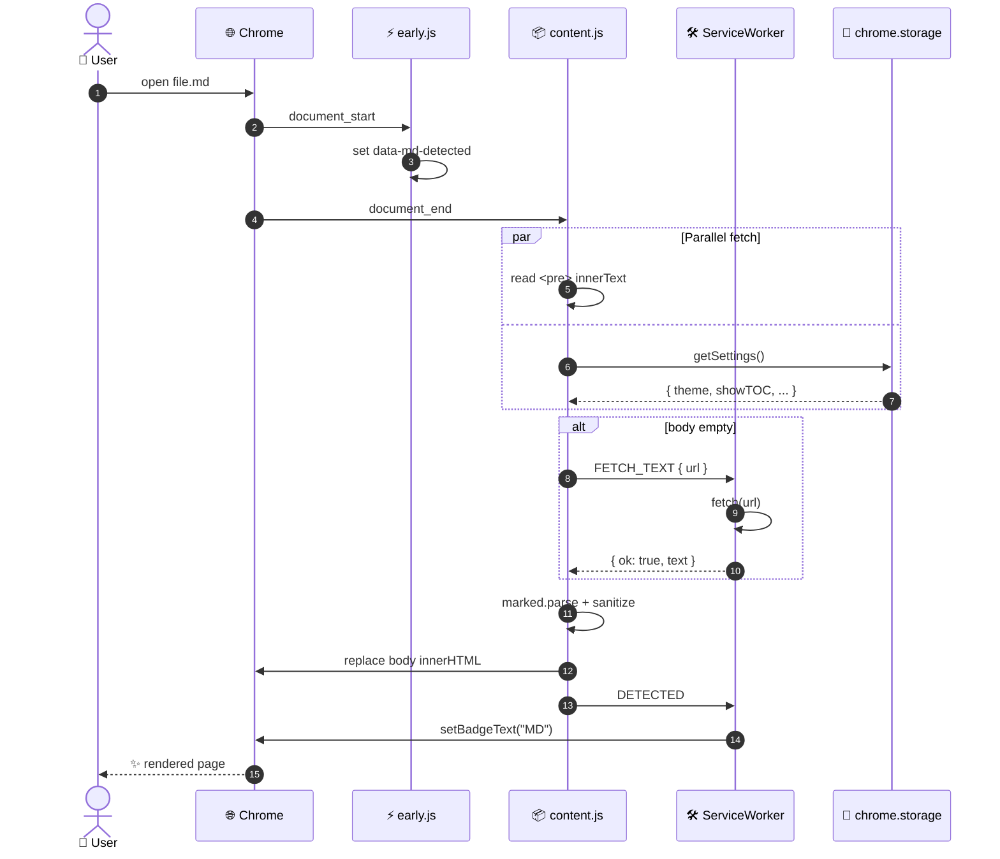

---

## 🏛️ Class diagram — Settings model

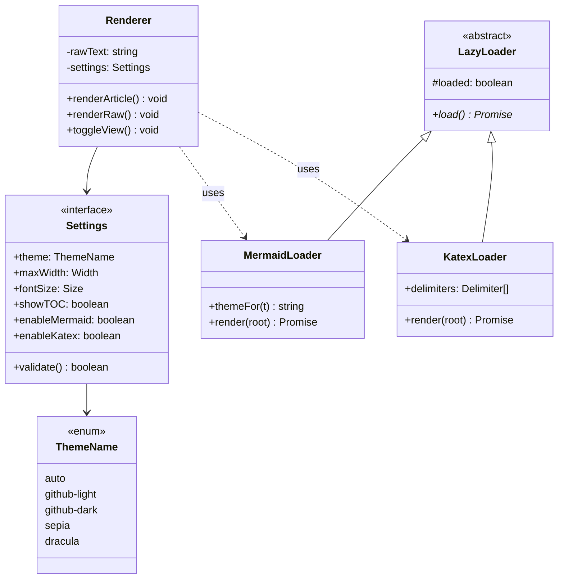

---

## 🔄 State machine — View mode

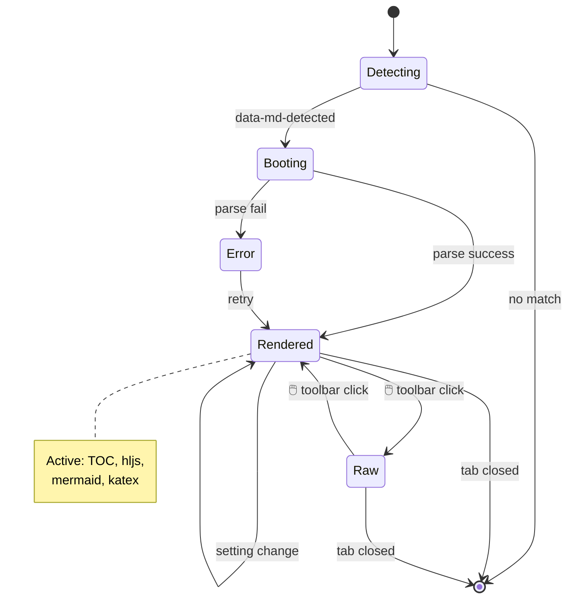

---

## 🗃️ ER diagram — Hypothetical schema

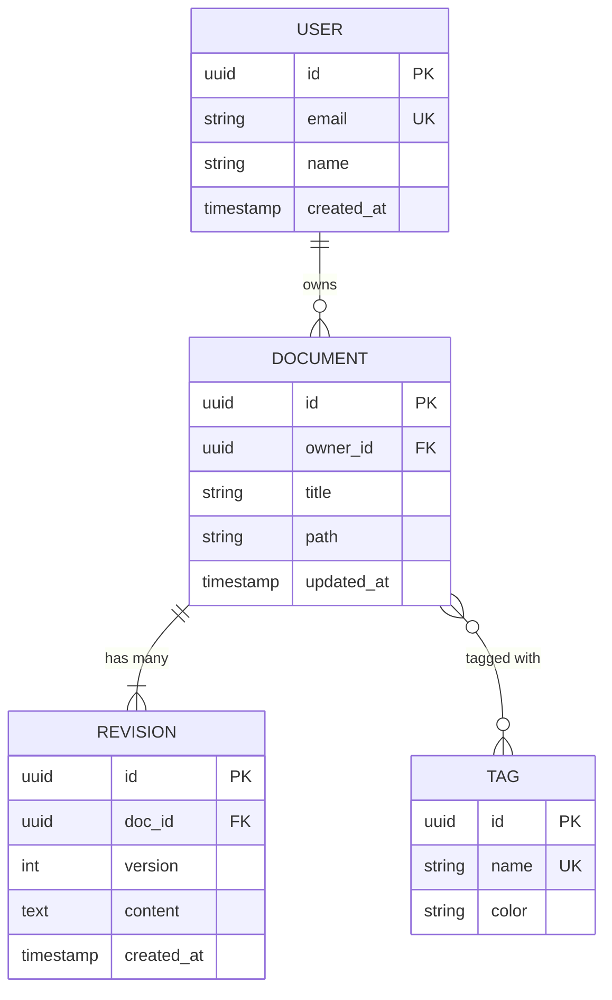

---

## 📅 Gantt — Release schedule

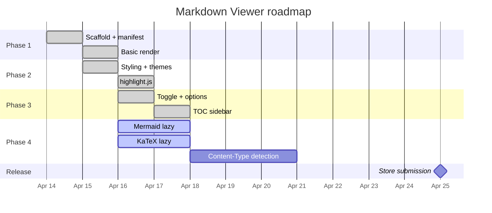

---

## 🥧 Pie chart — Bundle composition

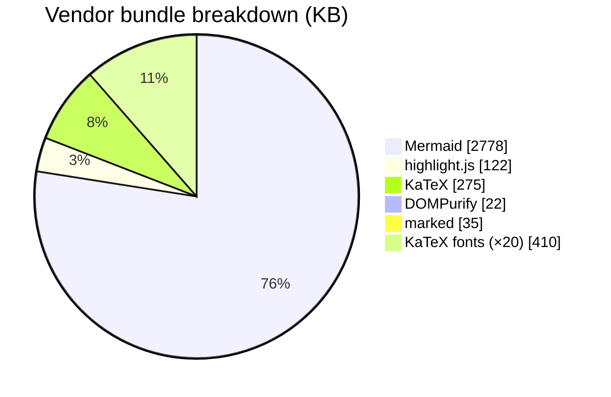

---

## 🗺️ User journey

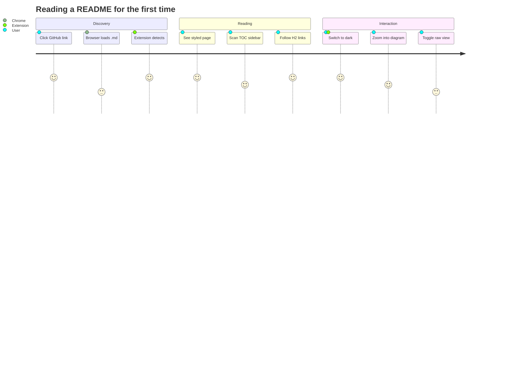

---

## 🌳 Git graph

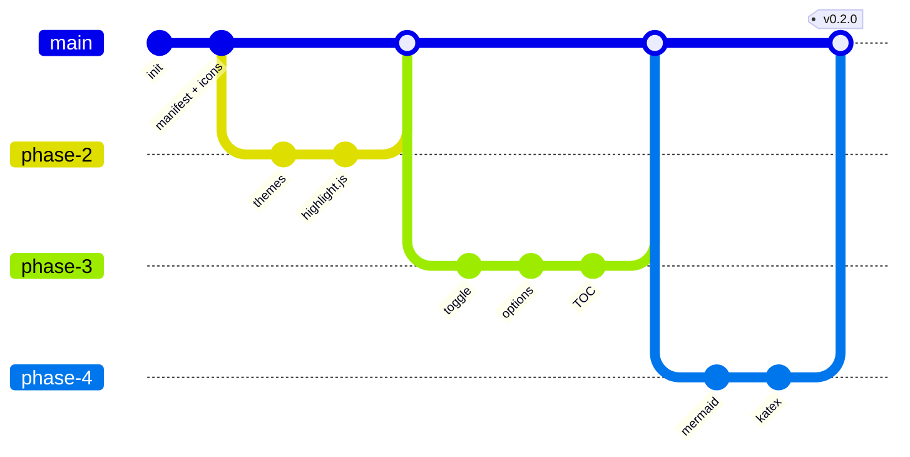

---

## 🧠 Mindmap

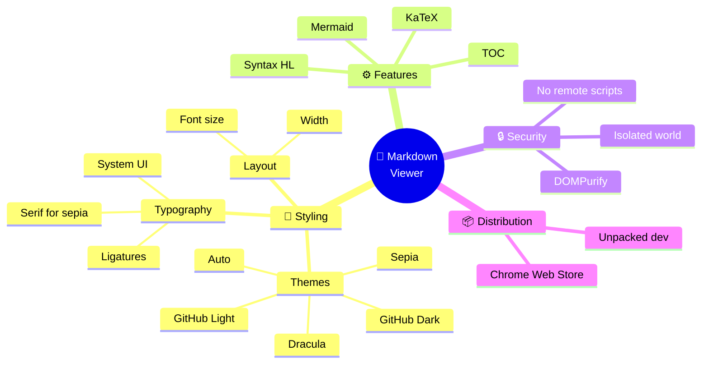

---

## 📊 Quadrant chart

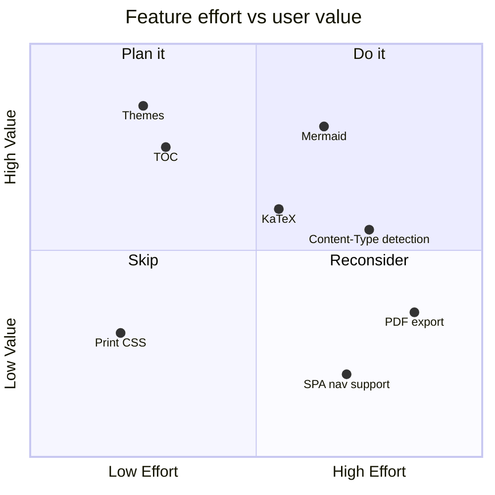

---

## 🔢 Math — when KaTeX is enabled

The Fourier transform:

$$\hat f(\xi) = \int_{-\infty}^{\infty} f(x)\, e^{-2\pi i x \xi}\, dx$$

Maxwell's equations in matter:

$$
\begin{aligned}
\nabla \cdot \mathbf{D} &= \rho_f \\
\nabla \cdot \mathbf{B} &= 0 \\
\nabla \times \mathbf{E} &= -\frac{\partial \mathbf{B}}{\partial t} \\
\nabla \times \mathbf{H} &= \mathbf{J}_f + \frac{\partial \mathbf{D}}{\partial t}
\end{aligned}
$$

Schrödinger's equation: $i\hbar \frac{\partial}{\partial t} \Psi = \hat{H} \Psi$.

---

## 💻 Code — many languages

### TypeScript

```typescript
interface Settings {
  theme: 'auto' | 'github-light' | 'github-dark' | 'sepia' | 'dracula';
  showTOC: boolean;
}

async function loadSettings(): Promise<Settings> {
  const s = await chrome.storage.sync.get({ theme: 'auto', showTOC: false });
  return s as Settings;
}
```

### Rust

```rust
fn render(input: &str) -> Result<String, RenderError> {
    let parsed = parse_markdown(input)?;
    let sanitized = sanitize(&parsed);
    Ok(sanitized)
}
```

### Python

```python
import asyncio
from typing import Optional

async def fetch_raw(url: str) -> Optional[str]:
    async with aiohttp.ClientSession() as s:
        async with s.get(url) as r:
            return await r.text() if r.ok else None
```

### SQL

```sql
SELECT d.title, count(r.id) AS revisions, max(r.created_at) AS last_edit
FROM document d
LEFT JOIN revision r ON r.doc_id = d.id
WHERE d.owner_id = $1
GROUP BY d.id
ORDER BY last_edit DESC NULLS LAST
LIMIT 20;
```

### Shell

```bash
#!/usr/bin/env bash
set -euo pipefail

for size in 16 32 48 128; do
  magick -background none -density 384 icon.svg -resize "${size}x${size}" "icon-${size}.png"
done
```

---

## ✅ Task list

- [x] Phase 1 — scaffold
- [x] Phase 2 — themes + highlight.js
- [x] Phase 3 — toggle + options + TOC
- [x] Phase 4 — Mermaid + KaTeX
- [ ] Chrome Web Store submission
- [ ] Firefox port
- [ ] Mobile Chrome test

---

## ⌨️ Keyboard reference

| Action | Shortcut |
|--------|----------|
| Toggle view | click <kbd>🧩</kbd> toolbar icon |
| Open options | right-click icon → Options |
| Reload extension | <kbd>⌘</kbd>+<kbd>R</kbd> on `chrome://extensions` |
| Hard refresh tab | <kbd>⌘</kbd>+<kbd>Shift</kbd>+<kbd>R</kbd> |

---

## 📝 Blockquote variants

> 💡 **Tip** — enable TOC from Options for long documents.

> ⚠️ **Warning** — Mermaid bundle is 2.7MB; only enable if you use it.

> 🔒 **Security** — all rendering happens locally; no network calls outside vendor assets.

---

## 🎯 Footer

That's it. If every section above renders cleanly, the extension is healthy 🎉.
